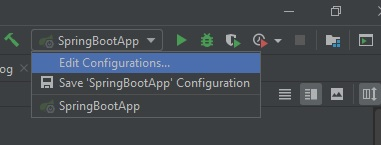
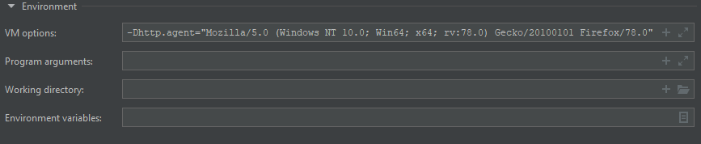

# Currency Web Service project

### How to launch


Need to have IntelliJ or other IDE 
```
IntelliJ: File >> New >> Project from Existing Source
```

Technologies: 
```
Java >=1.7, Maven
```
Make sure that the main class SpringBootApp is configured:
```
VM options: -Dhttp.agent="Mozilla/5.0 (Windows NT 10.0; Win64; x64; rv:78.0) Gecko/20100101 Firefox/78.0" 
```




You can access the website [http://localhost:8080/](http://localhost:8080/) by running SpringBootApp


